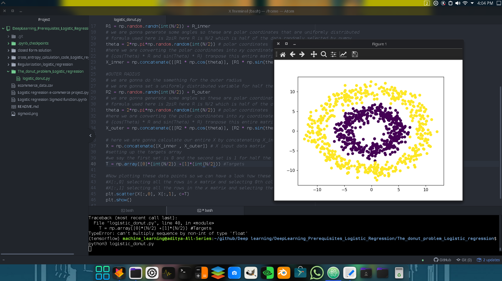
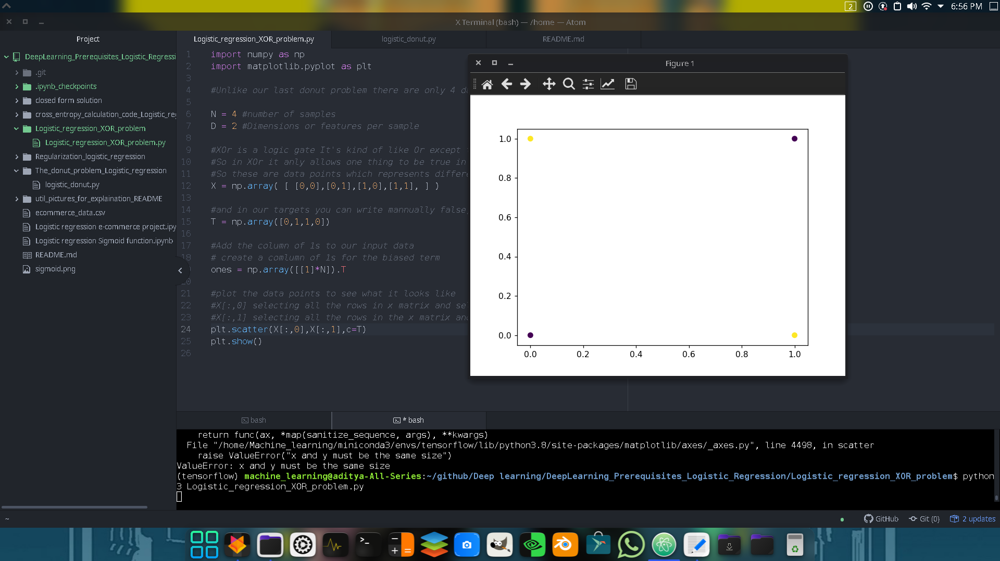
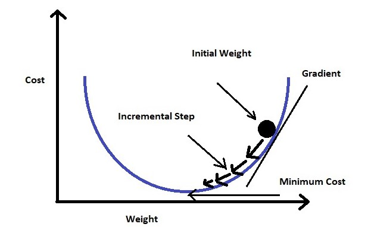
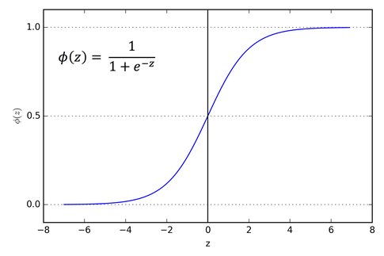

# This repository holds the basic fundamentals of logistic regression
### We know that logistic regression is treated as a single neuron and a nural network is a collection of neurons. Hence we can say that logistic regression is the fundamental building block of deep neural networks

## Problems related to Logistic Regression :
### Donut problem :

#### So Linear regression might not be good for this donut problem because there is no line that can separate the two dataset here in this case I's the Yellow and the Purple data point sets
```
TRICK OF THE DONUT PROBLEM:
       The trick with the donut problem is -> We are going to create yet another column which represents the radius of a point
       this will make your data points linearly separable

Code->
       r = np.zeros((N,1)) # creating a N size and 1 dimension of numpy array
       #manually calculate the radiuses
       for i in range(N):
           r[i] = np.sqrt(X[i,:].dot(X[i,:]))
       #Now then I do my concatenation the ones and the radiuses and It's all togeather
       #axis=1 -> adding ones npArray, r npArray and X npArray by column
       Xb = np.concatenate((ones,r,X), axis = 1)
```
#### In general you will have to experiment a little bit to find the right number for these values or you could use something like cross-validation
```
#set the learning rate to 0.0001
learning_rate = 0.0001
```

#### Calculating weights
```
for i in range(5000):
    #keep track of cross entropy so we can see how it evolves over time
    e = cross_entropy(T,Y)
    error.append(e)
    #print the cross_entropy every 100 times
    if i % 100 == 0:
        print(f"Cross_entropy error function : {e}")

    # using gradient with L2 regularization to find the optimal weights for the entropy function
    # L2 penalty here is 0.01 and L2 regularization is 0.01*w
    w+=learning_rate * (np.dot((T-Y).T, Xb) - 0.01*w)
    #re-calculating the output
    Y = sigmoid(Xb.dot(w))
```

#### Print the final weights and Final classification of the model
```
print(f"Final weights : {w}")
#when we are classifying we are actually rounding the output from the sigmoid function here in this case it's Y
print(f"Final classification rate : {1-np.abs(T-np.round(Y)).sum() / N}")
```

#### Explaining the output of the model
```
'''
    bias             radius        x coordinate    y coordinate
[-1.19218610e+01  1.60701810e+00  1.07760033e-03  9.60229312e-03]
The output of this is that our x and y are pretty close to zero
Classification doesn't really depend on the x and y coordinate at all is what this model has found
This model has found that the classification depends on the bias
here the radius that we'v put in the small radius and we have automatically have this bias to be -ve and that pushes the classification
towards zero
If the radius is bigger then it pushes the classification towards one
So that's how you can solve the donut problem
'''
```

### XOR problem :

#### Here you can see that there are 4 data points 2 are from class yellow and 2 are from class purple. So the trouble using logistic regression here is that you can't really find the line that will give you a perfect classification
#### REASON WHY LOGISTIC REGRESSION ISN'T APPLICABLE IN THIS XOR CASE ->
Here you can see that there are 4 data points 2 are from class yellow and 2 are from class purple.
So the trouble using logistic regression here is that you can't really find the line that will give you a perfect classification
#### TRICK TO SOLVE XOR PROBLEM VIA LOGISTIC REGRESSION ->
So the Trick is with the XOr problem is we're again going to add another dimension to our input
So We are going to turn it into a 3D peoblem instead of a 2D problem and then we can draw a plane between the two datasets
--> If we multiply the x and y to a new variable we can make the data linearly separable
```
xy = np.matrix(X[:,0]*X[:,1]).T
#Now then I do my concatenation the ones and the xy npArray and It's all togeather
#axis=1 -> adding ones npArray, xy npArray and X npArray by column
Xb = np.array(np.concatenate((ones,xy,X), axis=1))

'''
The rest of the code will be the same
'''
```
### These past two example bring out a really interesting point ->
#### You saw that we could apply the logistic regression to some compex problems by manual feature engineering. So we looked at the data and we determine some features that we could calculate the inputs that would help us improve our classification. Now in machine learning ideally the machine would be able to learn these things and so that is precisely what neural networks do. So in the future we will apply these problems and implement a neural networks that will automatically learn the features like this

## Gradient Descent :
#### Final output after applying gradient descent to find weights for the logistic regression function instead of randomly selecting weights

#### This is the graph that helps you visualize how a gradient descent is done

### Note->
Logistic function = Sigmoid funtion
#### The Sigmoid funtion graph is shown as below ->

